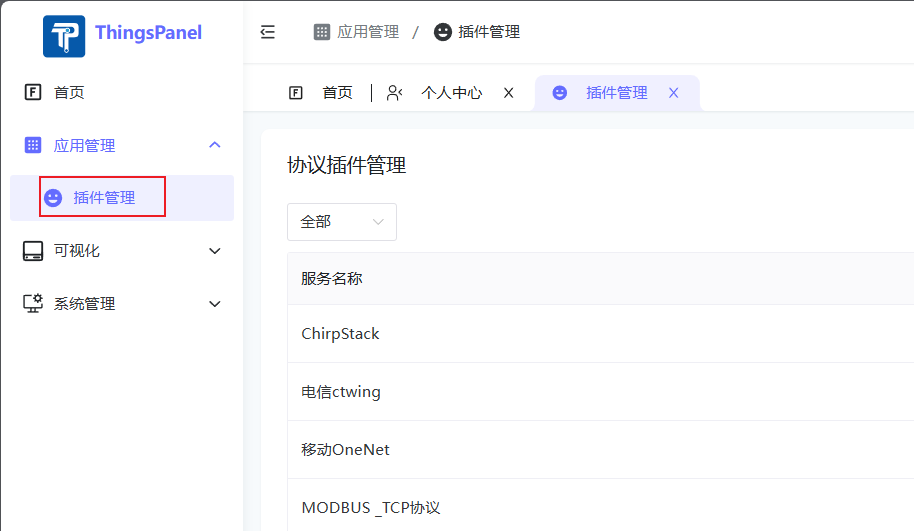
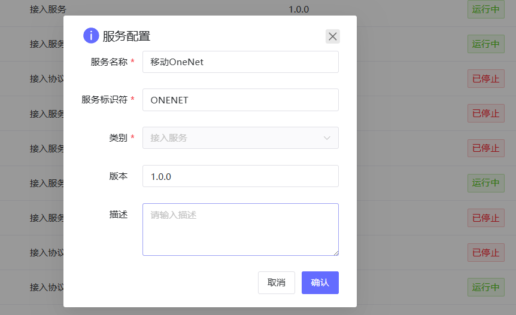
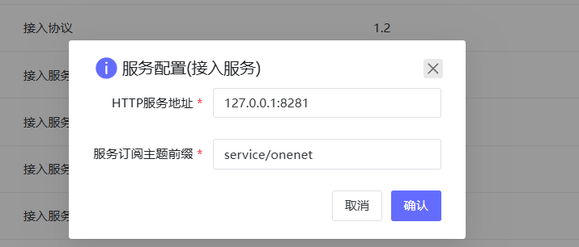

# 移动onenet接入

## 注册插件

- 登录到超管后台
- 进入插件管理添加新服务
  - 
  - 服务名称：移动OneNet（可自定义）
  - 服务标识符：ONENET
  - 类别：接入服务
  - 
- 点击服务配置按钮配置服务
  - HTTP服务地址：127.0.0.1:8281（提供给平台的HTTP服务，填写平台能够访问到的地址和端口）
  - 服务订阅主题前缀：service/onenet
  - 

## 对接步骤

 查看文档：[移动OneNET对接](http://thingspanel.io/zh-Hans/docs/device-connect/service_access/onenet)
